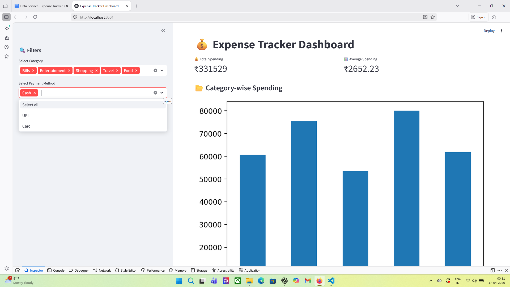
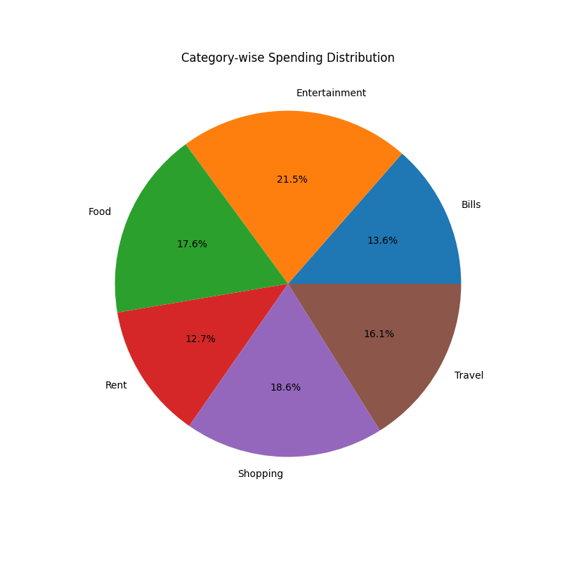
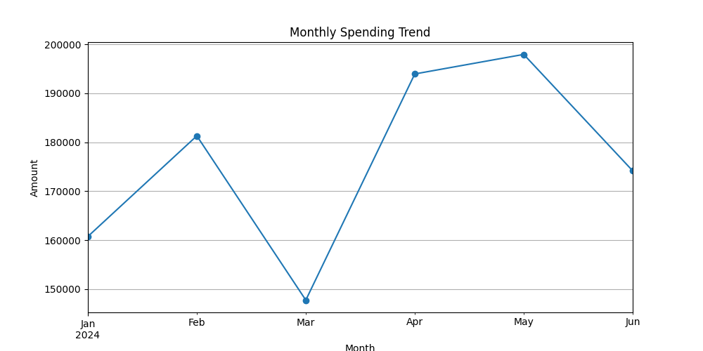

# expense-tracker-data-science
# 💰 Expense Tracker App using Data Science

## 📌 Overview

This project is a complete **Expense Tracker System** built using Python and Data Science techniques.
It helps users analyze their spending patterns, identify trends, and make better financial decisions.

---

## 🚨 Problem Statement

Managing personal finances is difficult without proper tracking.
People often don’t know:

* Where their money goes
* Which category consumes the most budget
* How spending changes over time

---

## ✅ Solution

This project provides:

* Expense data generation (synthetic dataset)
* Data cleaning & preprocessing
* Exploratory Data Analysis (EDA)
* Data visualization
* Insight generation
* Interactive dashboard using Streamlit

---

## ⚙️ Tech Stack

* Python
* Pandas
* NumPy
* Matplotlib
* Seaborn
* Streamlit

---

## 📂 Project Structure

```
Expense-Tracker-App/
│
├── data/
├── src/
├── images/
├── outputs/
├── notebooks/
├── app.py
├── main.py
├── requirements.txt
└── README.md
```

---

## 🚀 Features

* 📊 Category-wise spending analysis
* 📈 Monthly trend analysis
* 💳 Payment method insights
* ⚠️ Overspending detection
* 📉 Data visualization (charts)
* 🌐 Interactive dashboard

---

## ▶️ How to Run

### 1. Clone the Repository

```
git clone https://github.com/<your-username>/expense-tracker-data-science.git
cd expense-tracker-data-science
```

### 2. Install Dependencies

```
pip install -r requirements.txt
```

### 3. Run Scripts

```
python src/data_generator.py
python src/data_cleaning.py
python src/eda_analysis.py
python src/visualization.py
python src/insights.py
```

### 4. Run Dashboard

```
streamlit run app.py
```

---

## 📊 Results

* Identified highest spending categories
* Detected monthly spending trends
* Analyzed payment behavior
* Generated actionable financial insights

---

## 📸 Screenshots

### Dashboard



### Category Pie Chart



### Monthly Trend



---

## 🧠 Key Learnings

* Data cleaning and preprocessing
* Exploratory data analysis
* Data visualization
* Business insight generation
* Dashboard development

---

## 🔮 Future Improvements

* AI-based expense prediction
* Budget alerts system
* Mobile app integration
* Real-time expense tracking

---

## 👨‍💻 Author

Your Name
