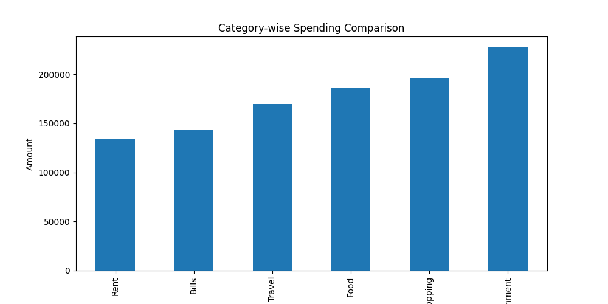
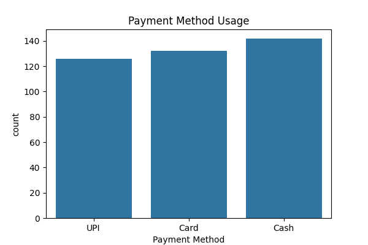

# 💰 Expense Tracker App using Data Science


---

## 📌 Overview

A complete **Data Science project** that tracks, analyzes, and visualizes expenses.
This project helps users understand spending patterns and make better financial decisions.

---

## 🚨 Problem

Most people:

* Don’t track expenses properly
* Don’t know where money goes
* Struggle with budgeting

---

## ✅ Solution

This project provides:

* Expense tracking system
* Data analysis using Python
* Visual insights through charts
* Interactive dashboard

---

## 📊 Dashboard Preview


---

## 📈 Visual Insights

### 🥧 Category-wise Spending


### 📊 Category Comparison



### 📈 Monthly Trend


### 💳 Payment Methods



---

## ⚙️ Tech Stack

* Python
* Pandas
* NumPy
* Matplotlib
* Seaborn
* Streamlit

---

## 🚀 Features

* 📊 Category-wise analysis
* 📈 Monthly trend detection
* 💳 Payment insights
* ⚠️ Overspending detection
* 🌐 Interactive dashboard

---

## 📂 Project Structure

```
Expense-Tracker-App/
│
├── data/
├── src/
├── images/
├── outputs/
├── notebooks/
├── app.py
├── requirements.txt
└── README.md
```

---

## ▶️ How to Run

```bash
git clone https://github.com/<your-username>/expense-tracker-data-science.git
cd expense-tracker-data-science
pip install -r requirements.txt
```

Run project:

```bash
python src/data_generator.py
python src/data_cleaning.py
python src/eda_analysis.py
python src/visualization.py
python src/insights.py
```

Run dashboard:

```bash
streamlit run app.py
```

---

## 📊 Results

* Identified highest spending category
* Detected monthly patterns
* Analyzed user behavior
* Generated actionable insights

---

## 🧠 Key Learnings

* Data Cleaning
* Exploratory Data Analysis
* Data Visualization
* Business Insights
* Dashboard Development

---

## 🔮 Future Improvements

* AI-based predictions
* Budget alerts
* Real-time tracking
* Mobile app

---

## 👨‍💻 Author

Md Anus

